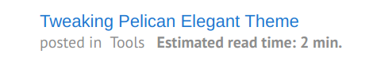

Readtime: A Plugin for Pelican
====================================================

[](https://github.com/pelican-plugins/readtime/actions)
[](https://pypi.org/project/pelican-readtime/)


A Read Time plugin for Pelican static site generator. After Pelican has generated the content of each page, the plugin reads through the generated HTML content and strips all the tags, counts all the words, and then utilizes the average human reading speed to calculate the read time of each article. The read time is passed over to the 'content' object of the article so the Jinja template can use it to display the read time wherever appropriate.

Demo
-----
The plugin can be embedded into your site's template and look like this:



An example can be found in my own blog [here](https://wayofnumbers.github.io/).

Installation
------------

This plugin can be installed via:

    python -m pip install pelican-readtime

Usage
-----

This plugin only uses standard modules(re, html, math, etc), so no extra module installation like BeautifuSoup. To use it, you can let Pelican auto-discover it via the namespace functionality or just add the plugin name to the **pelicanconf.py** file.

```python
    PLUGINS=[ ... , 'pelican-readtime']
```

Then you can put the following code in whichever template you what, like *article.html*.

```html
    
    <div><b>Read in {{article.readtime.minutes}} min.</b></div>
    
```

You can also add some styling to it like so:

```html
    
    <span><p style="text-align:right; color:#aaaaaa; ">&nbsp Estimated read time: {{article.readtime.minutes}} min.</p></span>
    
```

Credits
-----

This is a revised version of [jmaister's readtime plugin](https://github.com/jmaister/readtime). I added some more comments and tweaked the code so it runs smoothly on Python 3.6

Reference
-----

[1] Wikipedia - [Words per minute](https://en.wikipedia.org/wiki/Words_per_minute) <br>
[2] Medium - [Read Time](https://help.medium.com/hc/en-us/articles/214991667-Read-time) <br>

Contributing
------------

Contributions are welcome and much appreciated. Every little bit helps. You can contribute by improving the documentation, adding missing features, and fixing bugs. You can also help out by reviewing and commenting on [existing issues][].

To start contributing to this plugin, review the [Contributing to Pelican][] documentation, beginning with the **Contributing Code** section.

[existing issues]: https://github.com/pelican-plugins/readtime/issues
[Contributing to Pelican]: https://docs.getpelican.com/en/latest/contribute.html

License
-------

This project is licensed under the AGPL-3.0 license.
